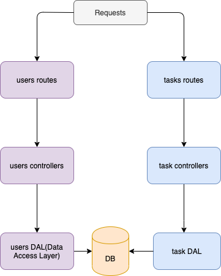

## About task

task is a to-do app that allows you to not just schedule your to-dos but also set the status of these tasks when they are completed or still pending
The **DEMO** version of the app is hosted [here](https://bunny-task-ui.netlify.app/)

## About The Codebase

This codebase is the **REST API** for the [Task app](https://bunny-task-ui.netlify.app/). The staging version of the API is hosted [here](https://bunny-to-do-app.herokuapp.com/).

## Technology Used

- NodeJS
- MongoDB
- Express
- Jest(testing)

## Setup

To setup the app,

1. Clone the app to your local machine and run `npm install`
2. Then run `npm start`

## Running tests
run `npm test`


## Folder Structure

```
task-api/
  .github
  node_modules/
  config/
        custom-environment-variables.json
        default.json
        test.json
  controllers/
        tasks.js
        users.js
  middleware/
        error.js
        validateObjectId.js
  models/
        task.js
        user.js
  routes/
        tasks-route.js
        users-route.js
  startup/
        db.js
        logging.js
        prod.js
        routes.js
        validation.js
  tests/
        integration/
                tasks.test.js
                users.test.js
  .gitignore
  index.js
  LICENSE
  package.json
  README.md
```

## Architecture



## Config Set up 

If you are deploying to production, you would need provide the following ENV variable on your server

```
db='mongo-connection-string'
```

## How to contribute

You can start contributing to the codebase once you're done with your local setup.

## Rest API Documentation

Once you're done setting up, you can read about the `endpoints` on postman.
At the moment the API documentation is hosted on Postman:<br>
[](https://documenter.getpostman.com/view/5974922/UVC3kTwW)

